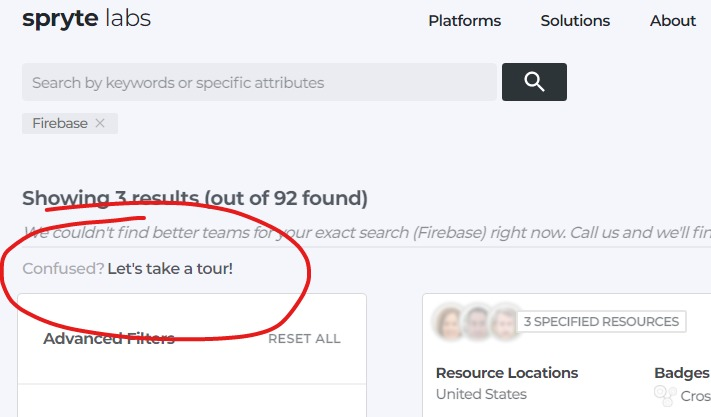
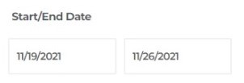
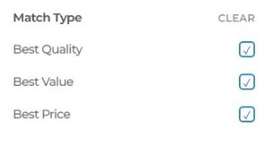
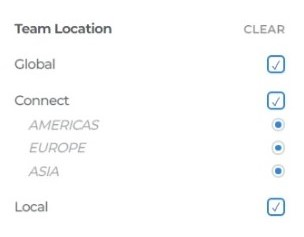
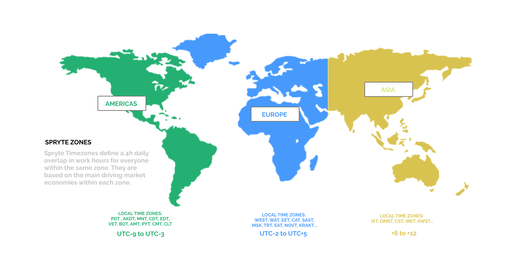
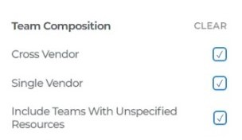
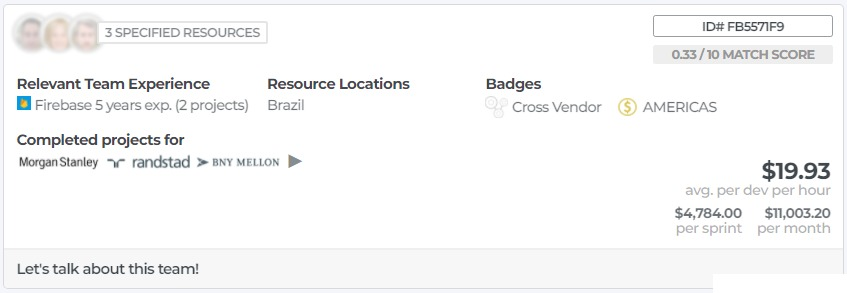
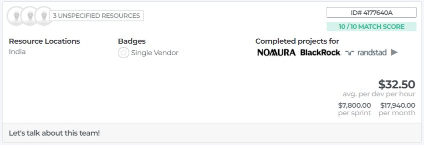
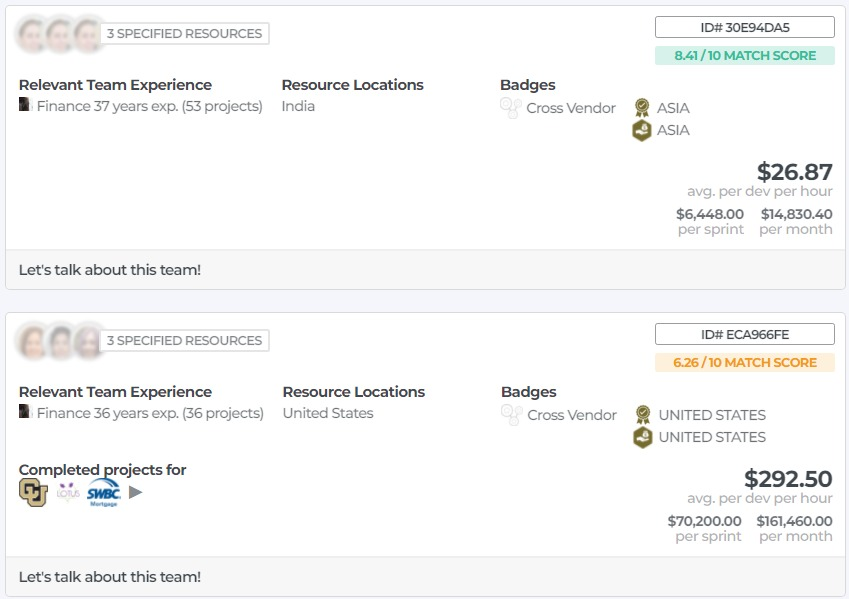

# The Spryte Client Platform

Spryte's tech marketplace allows anyone looking for technology development for find the right team in 3-clicks. We believe that

> "Finding and managing a tech team should be easy, fast, and transparent"

Under the hood, and in order to make this happen, we compute trillions of combinations of developers for each client request. To find the perfect team, we currently combine developers based on the following parameters: 
- Availability
- Pricing
- Tech Stack
- Domain Knowledge
- Project Experience
- Team Size
- Geolocation
- Security Level
- Project Start Date

We provide real-time data based confirmed availability, much like modern hotel/airline GDS's. 

For more information on the Spryte Client App, see [the Spryte Labs website.](https://www.sprytelabs.com) 

## First, take the TOUR

We highly recommend you take the 1min tour of the Spryte Results page...it should answer all your questions. If you prefer to read...read on.

#### Client Account Types & Limits

##### Account Registration
In order to use Sprytelabs.com, you'll find it best to register an account. Your account type will be Bronze by default. Speak to your Account Manager to upgrade your account.

<iframe src="https://player.vimeo.com/video/656279154?h=6a4dabc900&amp;badge=0&amp;autopause=0&amp;player_id=0&amp;app_id=58479" frameborder="0" allow="autoplay; fullscreen; picture-in-picture" allowfullscreen style="position:absolute;top:0;left:0;width:100%;height:100%;" title="Registration-v1.mp4"></iframe>

##### A. **BRONZE** Account Type (New Client)
New clients with Spryte can have a single open requirement list, with only one Team Under Consideration (TUC).

##### B. **SILVER** Account Type (Qualified Client)
Qualified clients with Spryte can have three open requirement lists, with up to three Teams Under Consideration (TUC) in each list.

##### C. **GOLD** Account Type (Power Users)
Qualified clients with Spryte can have up to 20 open requirement lists, with up to four Teams Under Consideration (TUC) in each list.

## Searching For Teams

Spryte is a marketplace for technology teams. We've partnered with hundreds of tech shops around the world, who all compete for your business. We realized that the client experience buying technology is pretty confusing, time consuming and risky. If you're an industry veteran, you might be ok. If you're a non-technical founder who needs technology to grow your business, good luck. Our focus is on helping our customers find the right tech team for the job, in a matter of minutes, and with complete transparency.

1. type in the stack, industry or project type that you need. If you don't know the stack, stick to an industry or a project type. For example, "custom website in Insurance". Our matching algorithm will give you the best available teams we can find, available for your dates, and with real pricing.

2. it's that easy. Click to chat with us about this team if you're unsure, or book directly on the site.

## Choosing a Team (Filtering & Sorting)

Spryte works by giving you only the best options. We don't think a long list of hundreds of teams helps anyone. We return only 3 teams for your search:
1. the best quality team: the highest ranking team in terms of technical ability
2. the best value team: the team with the best quality/price score
3. the best price team. A qualified team that knows your stack/project type/industry, and has the lowest price we could find

We thought long and hard about how we buy technology, and we couldn't find any scenarios where you would want more choice. 

Our matching algorithm returns teams of 1-8 developers, for as many regions around the world as we find. In practice this means you can get many hundreds of team results, but we recommend you filter and sort to easily pick the very best team for your needs. 

### Filters

1. **Date Range**: You can select a date range for the **START DATE** of your project. This will show you all available teams who can **START** within these dates. We recommend you widen your range to a month or two in order to find better pricing. If you need resources to start **immediatly**, your choices will be reduced, and the price higher. 

2. **Team Size**: You can get individual developers (teamsize of 1) up to teams of 8 on Spryte. There are certain pricing advantages to teams of 3-5, and generally single developers cost more, as teams functions more effectively for our partners.

3. **Match Type**: As described above, you can choose to filter out teams based on which criteria you prefer. You can also sort using these criteria.

4. **Location**: Your team's location is one of the most important factors to set. For lower pricing, generally choose global. For simpler management due to work hours and communication, choose the ***Connect*** timezone you're in. We've defined 3 general zones whithin which there is a significant work day overlap: Americas, Europe/Africa & Asia. If it's important to you to have a team within your country, choose local. As we grow you'll have the ability to choose a local team in your city or neighborhood.

  

5. **Team Composition**
    1. Cross Vendor teams mean your developers within the same team might be working for different Spryte partners. You may want this for IP concerns, though it's often more difficult to manage.
    2. In a Single Vendor team, all your developers work for the same Spryte Partner. It's often more efficient, and as you're a more consequential client for that partner, easier to manage.
    3. Since March 2021, we've added the ability for partners to propose their team pricing ahead of time, without real-time availability. Teams with unspecified resources will have to be confirmed by the partner, which could take 24 to 48h. On the upside, it provides you with many more teams and specialties to choose from. If you need a team immediatly, you might want to fitler these teams out.

     

## A Team Price Card

     

Price cards reveal ***we hope*** all the information you need to select a team quickly. 

    
  
 

## Requirement Lists

Once you've registered on Sprytelabs.com, you can add and maintain requirement lists. Requirement lists allow you to compare multiple teams, review the resources proposed by our Partners, and select a team for your next project. Each requirement list has some deadlines, depending on your account type with Spryte. 

### How-to Guides

1. Basic Usage

<iframe src="https://player.vimeo.com/video/656300120?h=bf02f83607&amp;badge=0&amp;autopause=0&amp;player_id=0&amp;app_id=58479" frameborder="0" allow="autoplay; fullscreen; picture-in-picture" allowfullscreen style="position:absolute;top:0;left:0;width:100%;height:100%;" title="Creating a basic Requirement List-01.mp4"></iframe>

2. Advanced Usage

<iframe src="https://player.vimeo.com/video/656300667?h=6ce132283c&amp;badge=0&amp;autopause=0&amp;player_id=0&amp;app_id=58479" frameborder="0" allow="autoplay; fullscreen; picture-in-picture" allowfullscreen style="position:absolute;top:0;left:0;width:100%;height:100%;" title="Advanced-Requirement-Lists-01.mp4"></iframe>

### Process & Deadlines
Requirements follow a basic 3-step process. 

#### Step 1: Confirm Requirements
First you confirm your project expectations (expected start date range, price range, engagement time and type). Please take into account that once you confirm, real people in our Partner companies around the world will take time and resources to propose their best resources for your project. Please be mindful of their time by only confirming if you have a real intent to buy.

#### Step 2: Review and Confirm Resources
Once you've confirmed, our Spryte Partners can respond and propose their available resources. You can:

  1. review resource profiles (resumes)
  2. tag resources to manage your review process
  3. add notes and comments
  4. Confirm or Discard each resource

#### Step 3: Book
Once you've confirmed the resources you wish to hire/engage, Step 3 allows you to manage payments, subscriptions and payment plans.

### Payments
TBD

### Terms and Conditions
TBD

# Your Personal Account Page Options

## Profile Options

### Improve your Personal Profile
TBD

### Get Rated
TBD - perform a Spryte Assessment & get your stacks skills rated objectively

### Get Recognized
TBD - be considered for a Spryte Spotlight, & perform a video Interview

## Earn Options

###  Create a Referral
TBD

### Find a Job
TBD

### Join the Spryte Expert Network
TBD

# Your Company Account Page Options

## Match 
The match page allows you to set your company match settings. Once set, you'll receive 6 AI Matched relevant profiles every week, month or whichever frequency you've set under the Notification Settings.

## Search
The search tab lets you search & browse all available devs on the platform, think of it as the open bench from all Spryte Partners. You can filter by location, skills, position, and even partner company to view individual vendors.

## Favorites
Save favorite devs by clicking on the Heart icon on any Dev Card. Your favorites will be saved in the Favorites Tab, just click the heart icon again to remove them. Only companies with associated users have the favorites tab enabled.