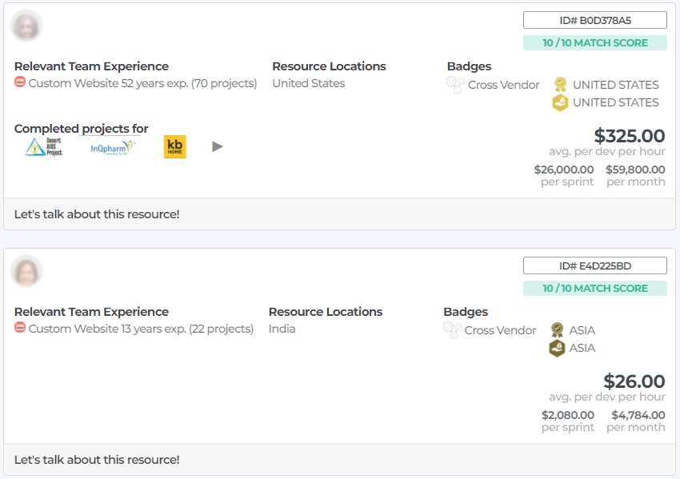

# The Spryte Client Platform

Spryte's tech marketplace allows anyone looking for technology development for find the right team in 3-clicks. We believe that

> "Finding and managing a tech team should be easy, fast, and transparent"

Under the hood, and in order to make this happen, we compute trillions of combinations of developers for each client request. To find the perfect team, we currently combine developers based on the following parameters: 
- Availability
- Pricing
- Tech Stack
- Domain Knowledge
- Project Experience
- Team Size
- Geolocation
- Security Level
- Project Start Date

We provide real-time data based confirmed availability, much like modern hotel/airline GDS's. 

For more information on the Spryte Client App, see [the Spryte Labs website.](https://www.sprytelabs.com) 

## First, take the TOUR

We highly recommend you take the 1min tour of the Spryte Results page...it should answer all your questions. If you prefer to read...read on.

#### Client Account Types & Limits

##### Account Registration
In order to use Sprytelabs.com, you'll find it best to register an account. Your account type will be Bronze by default. Speak to your Account Manager to upgrade your account.

<iframe src="https://player.vimeo.com/video/656279154?h=6a4dabc900&amp;badge=0&amp;autopause=0&amp;player_id=0&amp;app_id=58479" frameborder="0" allow="autoplay; fullscreen; picture-in-picture" allowfullscreen style="position:absolute;top:0;left:0;width:100%;height:100%;" title="Registration-v1.mp4"></iframe>

##### A. **BRONZE** Account Type (New Client)
New clients with Spryte can have a single open requirement list, with only one Team Under Consideration (TUC).

##### B. **SILVER** Account Type (Qualified Client)
Qualified clients with Spryte can have three open requirement lists, with up to three Teams Under Consideration (TUC) in each list.

##### C. **GOLD** Account Type (Power Users)
Qualified clients with Spryte can have up to 20 open requirement lists, with up to four Teams Under Consideration (TUC) in each list.

## Searching For Teams

Spryte is a marketplace for technology teams. We've partnered with hundreds of tech shops around the world, who all compete for your business. We realized that the client experience buying technology is pretty confusing, time consuming and risky. If you're an industry veteran, you might be ok. If you're a non-technical founder who needs technology to grow your business, good luck. Our focus is on helping our customers find the right tech team for the job, in a matter of minutes, and with complete transparency.

1. type in the stack, industry or project type that you need. If you don't know the stack, stick to an industry or a project type. For example, "custom website in Insurance". Our matching algorithm will give you the best available teams we can find, available for your dates, and with real pricing.

2. it's that easy. Click to chat with us about this team if you're unsure, or book directly on the site.

## Choosing a Team (Filtering & Sorting)

Spryte works by giving you only the best options. We don't think a long list of hundreds of teams helps anyone. We return only 3 teams for your search:
1. the best quality team: the highest ranking team in terms of technical ability
2. the best value team: the team with the best quality/price score
3. the best price team. A qualified team that knows your stack/project type/industry, and has the lowest price we could find

We thought long and hard about how we buy technology, and we couldn't find any scenarios where you would want more choice. 

Our matching algorithm returns teams of 1-8 developers, for as many regions around the world as we find. In practice this means you can get many hundreds of team results, but we recommend you filter and sort to easily pick the very best team for your needs. 

### Filters

1. **Date Range**: You can select a date range for the **START DATE** of your project. This will show you all available teams who can **START** within these dates. We recommend you widen your range to a month or two in order to find better pricing. If you need resources to start **immediatly**, your choices will be reduced, and the price higher. 

2. **Team Size**: You can get individual developers (teamsize of 1) up to teams of 8 on Spryte. There are certain pricing advantages to teams of 3-5, and generally single developers cost more, as teams functions more effectively for our partners.

3. **Match Type**: As described above, you can choose to filter out teams based on which criteria you prefer. You can also sort using these criteria.

4. **Location**: Your team's location is one of the most important factors to set. For lower pricing, generally choose global. For simpler management due to work hours and communication, choose the ***Connect*** timezone you're in. We've defined 3 general zones whithin which there is a significant work day overlap: Americas, Europe/Africa & Asia. If it's important to you to have a team within your country, choose local. As we grow you'll have the ability to choose a local team in your city or neighborhood.

  

5. **Team Composition**
    1. Cross Vendor teams mean your developers within the same team might be working for different Spryte partners. You may want this for IP concerns, though it's often more difficult to manage.
    2. In a Single Vendor team, all your developers work for the same Spryte Partner. It's often more efficient, and as you're a more consequential client for that partner, easier to manage.
    3. Since March 2021, we've added the ability for partners to propose their team pricing ahead of time, without real-time availability. Teams with unspecified resources will have to be confirmed by the partner, which could take 24 to 48h. On the upside, it provides you with many more teams and specialties to choose from. If you need a team immediatly, you might want to fitler these teams out.

     

## A Team Price Card

     

Price cards reveal ***we hope*** all the information you need to select a team quickly. 

    
  
 

## Requirement Lists

Once you've registered on Sprytelabs.com, you can add and maintain requirement lists. Requirement lists allow you to compare multiple teams, review the resources proposed by our Partners, and select a team for your next project. Each requirement list has some deadlines, depending on your account type with Spryte. 

### How-to Guides

1. Basic Usage

<iframe src="https://player.vimeo.com/video/656300120?h=bf02f83607&amp;badge=0&amp;autopause=0&amp;player_id=0&amp;app_id=58479" frameborder="0" allow="autoplay; fullscreen; picture-in-picture" allowfullscreen style="position:absolute;top:0;left:0;width:100%;height:100%;" title="Creating a basic Requirement List-01.mp4"></iframe>

2. Advanced Usage

<iframe src="https://player.vimeo.com/video/656300667?h=6ce132283c&amp;badge=0&amp;autopause=0&amp;player_id=0&amp;app_id=58479" frameborder="0" allow="autoplay; fullscreen; picture-in-picture" allowfullscreen style="position:absolute;top:0;left:0;width:100%;height:100%;" title="Advanced-Requirement-Lists-01.mp4"></iframe>

### Process & Deadlines
Requirements follow a basic 3-step process. 

#### Step 1: Confirm Requirements
First you confirm your project expectations (expected start date range, price range, engagement time and type). Please take into account that once you confirm, real people in our Partner companies around the world will take time and resources to propose their best resources for your project. Please be mindful of their time by only confirming if you have a real intent to buy.

#### Step 2: Review and Confirm Resources
Once you've confirmed, our Spryte Partners can respond and propose their available resources. You can:

  1. review resource profiles (resumes)
  2. tag resources to manage your review process
  3. add notes and comments
  4. Confirm or Discard each resource

#### Step 3: Book
Once you've confirmed the resources you wish to hire/engage, Step 3 allows you to manage payments, subscriptions and payment plans.

### Payments
TBD

### Terms and Conditions
TBD

# Your Personal Account Page Options

## Profile Options

### Improve your Personal Profile
TBD

### Get Rated
TBD - perform a Spryte Assessment & get your stacks skills rated objectively

### Get Recognized
TBD - be considered for a Spryte Spotlight, & perform a video Interview

## Earn Options

###  Create a Referral
TBD

### Find a Job
TBD

### Join the Spryte Expert Network
TBD

# Your Company Account Options

## Company Account Page

The Company Account Page is your internal dashboard on Spryte. It’s where you establish the foundation of your company’s presence, visibility, and ranking within the Spryte ecosystem.

This dashboard guides you through key onboarding steps and ensures your profile aligns with Spryte’s industry ranking system. From here, you can manage account settings, upload content for your public company profile, highlight your marketing technology strengths, and view your key points of contact at Spryte.

The information you provide on this page may be used to optimize your placement in the Spryte Index and to evaluate your eligibility for future awards and spotlight features.

### Feature Breakdown

#### Suggestions – Next Steps:

This section provides clear next steps to help you get started. Action cards will walk you through important setup milestones such as claiming and updating your public company profile, describing your technology teams, and learning about the Spryte Spotlight program. Each item links to supporting documentation to guide you through the process.

#### Technology:

Here is where you can describe your technology teams in detail, including team sizes and specializations, manage your project requirements, and view matches to opportunities that align with your capabilities. This section also gives you access to the Spryte roster, where you can explore additional development resources. A designated Technology Head can be assigned to manage this area, with an option to upload their resume.

#### Marketing:

The marketing section focuses on showcasing your company’s marketing technology strengths. You can define the tools and platforms you use to engage your audience and promote your products. Completing this section helps Spryte categorize your company effectively and improves your visibility within relevant industry segments. As with the technology section, you can assign a Marketing Head who can manage this section.

#### Account Settings:

This section allows you to configure your Spryte account and designate an Account Settings Head.

#### Account Information:

The account information panel shows some of your organization’s key information. It includes your company name, business unit, linked domain, registered users, and company executives. 

#### Spryte Points of Contact:

Here you will find contact cards for your Account Manager and Success Manager at Sprtye. 

Your Account Manager is your primary point of contact for account configuration, open requirements, hiring and information on your company’s rankings.

Your Success Manager can help you launch a new project with Spryte and answer any questions related to ongoing projects.

### How to access your Company Account Page

Please log into the dashboard. If you are new to Spryte Labs you will need to create an account.

1.	Go to the dropdown menu and navigate to **My Company**. Select **Account**

## Company Profile Page
Spryte’s Company Profile Pages are curated landing pages that showcase your company on our platform. Each page functions as a digital portfolio for potential clients and appllicants to learn about your company's leadership, core products, and tech stack. Your profile also highlights your expertise and industry standing through awards, sector rankings, and Spryte Spotlight features.

### Feature Breakdown

#### Company Overview: 
Displays your company name, logo, website, description, tags, and any earned Spryte awards (refer to [Spryte Spotlight](https://sprytelabs.com/spotlight) for more information). 

#### Specialty Sector Ranking:
Showcase how your company ranks within your primary sector and subsectors. Rankings are derived from a combination of third-party and public data, company provided information and market expert analysis.

Refer to [Spryte Index Methodology & Data](https://firebasestorage.googleapis.com/v0/b/spryte-p.appspot.com/o/Assets%2FDocuments%2FSpryte%20Index%20Methodology%20%26%20Data%20v2.pdf?alt=media&token=2d1bb4d8-5a78-4e35-8b30-f0494bf7e16a) for more information on the Spryte Index.

#### Technology Products We Make:
Highlight key products and services your company offers. Choose from Spryte’s extensive product library—or work with your Account Manager to add custom entries that reflect your unique offerings.

#### Technology Products We Use
Give prospective clients and collaborators a clear picture of your tech stack by listing the software, frameworks, platforms, and services your team actively uses. This can help them understand your team's strengths and compatibility with their own tech stack.
You can select from Spryte’s existing technology catalog or contact your Account Manager for custom entries. 

#### Open Positions
Showcase current job openings to signal company growth and attract qualified talent. Open positions are pulled from online job boards, company websites, or can be added manually through your Spryte partner dashboard.

#### Open Candidature (Under Development)
The Open Candidature feature allows interested professionals to submit their profiles and resumes even when no open roles are listed. This is ideal for companies building talent pipelines or seeking specialized skillsets on a rolling basis.
Candidates can browse your company profile and submit their interest through a dedicated form, ensuring you're not missing out on potential contributors just because a formal role hasn’t been posted yet.

#### Start an Internship (Under Development)
This feature enables recent graduates and early-career professionals to express their interest in interning with your company, even if no internships are currently posted. It’s a great way to engage emerging talent who are enthusiastic about your work and want to contribute to your team.

### How to access your Company Profile Page
Please log into the dashboard. If you are new to Spryte Labs you will need to create an account.

1.	Go to the dropdown menu and navigate to **My Company**. Select **Profile**

2.	You can request control of your Company Profile Page by clicking on **Work at XXX? Take control of this page** and click “Add a work email”. Your email domain name must match the company name.

3.	Verify your email. 

4.	You can now edit tags, products and tech stack on your company profile. 

## Match 
The match page allows you to set your company match settings. Once set, you'll receive 6 AI Matched relevant profiles every week, month or whichever frequency you've set under the Notification Settings.

## Search
The search tab lets you search & browse all available devs on the platform, think of it as the open bench from all Spryte Partners. You can filter by location, skills, position, and even partner company to view individual vendors.

## Favorites
Save favorite devs by clicking on the Heart icon on any Dev Card. Your favorites will be saved in the Favorites Tab, just click the heart icon again to remove them. Only companies with associated users have the favorites tab enabled.