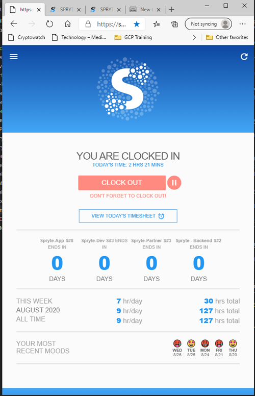
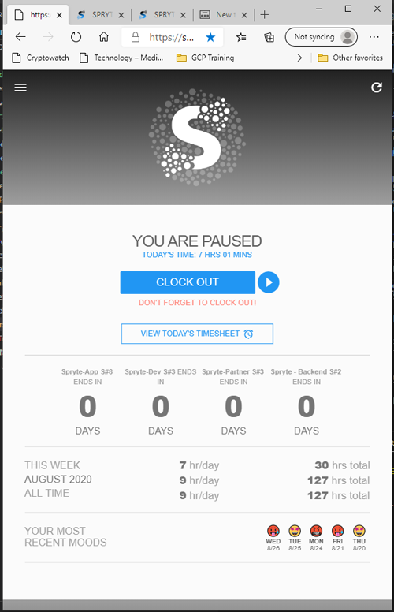

# The Spryte Developer Platform

The Spryte Developer Platform is only for active developers. It allows devs to report on their active projects.

## Registration

Developers who work on Spryte projects must first register on the Developer Platform. Of crucial importance are the Geolocation Latitude and Longitude, which must indicate where you are actually working from (home if you are working from home). [You can use google maps to determine your actual geo-location.](https://support.google.com/maps/answer/18539?co=GENIE.Platform%3DAndroid&hl=en) 

## Clocking In & Out (Timesheet Home page)

The home page of the Developer platform is a basic timesheet feature, which allows you to clock-in at the begining of your work day, and clock-out at the end. It it important that you clock-out before midnight, and that you do this for every work-day. Pausing & Unpausing should be restricted to any time off you take during the work day which is not work-related. In certain jurisdictions, local laws define how much of your day is paid rest time, please observe your local laws at all times.

## Pause & Un-pause (Breaks)

Ask your employer how to count breaks. While your Spryte's timesheets are a record of your daily work hours, they are not being used for billing. This means overtime hours clocked on the app are not used for billing. Please ensure you are working according to your contracted terms.  There are certain scenarios to consider depending on your local labor laws, please ask your employer. 

              