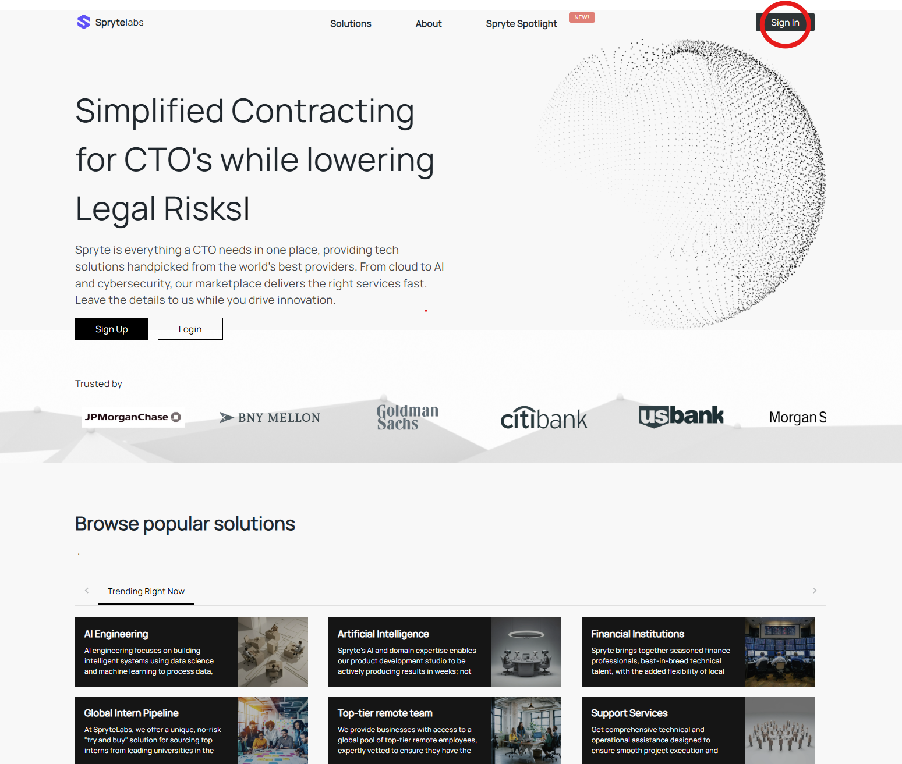
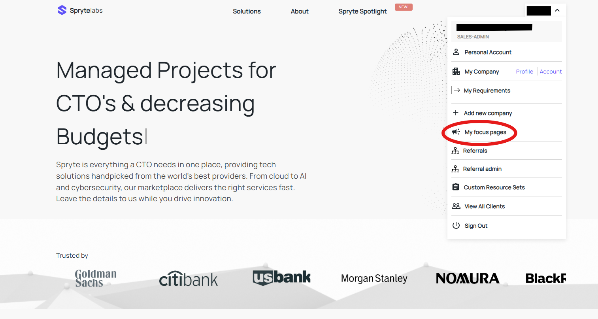
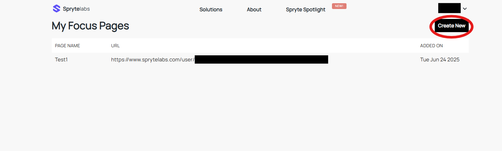
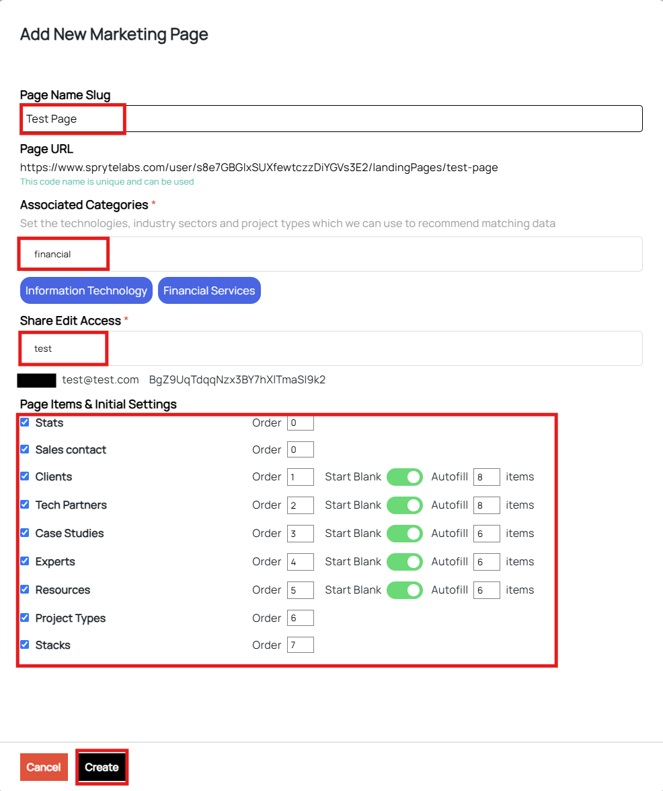
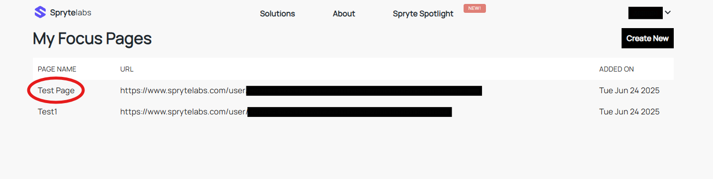
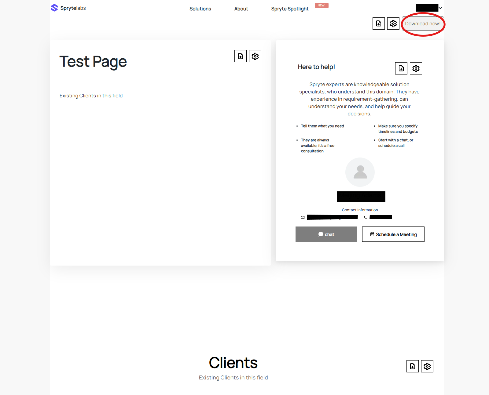

## Focus Page

A focus page is a marketing tool designed to help marketing professionals reach new clients in specific industries. Each focus page acts as a curated landing page providing personalized content based on relevant technologies, sectors, and project types. This feature generates a unique URL and downloadable promotional material that can be shared with potential clients.

### How to create a new Focus Page

1.	First log into the dashboard. If you are new to Spryte Labs please create an account.

2.	Go to the dropdown menu and select **My Focus Page**

3.	Navigate to **Create New**

 

4.	Input **Page Name Slug**, **Associated Categories**, **Share Edit Access**, and adjust **Page Items & Initial Settings** to your preferences. Click **Create**.

 

### How to view an existing Focus Page

1.	Log into the dashboard.

2.	Go to the dropdown menu and select **My Focus Page**

3. Click to select the desired Focus Page from the list, the page will open in a new tab.

4.	To download the promotional material, click the **Download Now!** button.

