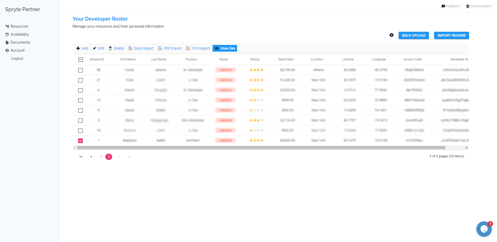
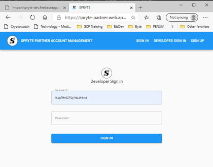

# The Spryte Partner Platform

The Partner Platform is meant for Technology vendors and agencies. If you currently hire and manage developers to create custom technology for your clients,
you can become a Spryte Partner by registering on the platform.

## Benefits

There are many benefits to joining the Spryte platform as a development partner. Think of us as your window into a whole new world of clients and projects.
Partners are instantly accessible by all spryte clients, who can search for development teams in real time. Pricing is transparent to the user, but your information is never revealed.  

## Use cases

1. Get More projects
2. See how you fit within the competitor landscape, and fine tune your business
3. Improve margins and remove operational friction

## Registration

1. To register, log on to [The Spryte Partner Platform](https://spryte-partner.web.app/). We will ask you for basic information about your business. Make sure the person registering your account has an appropriate role within your organisation to handle rates & contract decisions.

2. You can enter your developer's information one by one from the **Resources** page in the **Developer Roster** grid. Make sure you hit ***UPDATE*** after adding new rows or before leaving the page. 

3. A unique ACCESS CODE is generated for each developer. Because adding in all the required information such as stack, domain and project experience can take long time, you can provide each developer in your company with their **access code** and **unique id**. Using the **Developer Login** screen, they can gain access to their own unique profile, and add the information which matches their resume (CV) at their leisure.   

## Onboarding your developer data

As an account manager, you have multiple options for adding information about your Developer Roster. You can enter all their information one-by-one, but to get started quickly we recommend using the **bulk-import** function. 

### Bulk Import

On the **RESOURCES** page of your admin account panel, you will find an empty grid, with a blue **BULK UPLOAD** button. 

You can use the  to gather information from your team. Export it as a .csv, and copy the text into the bulk upload modal popup.

In case you have erroneous keys, the upload tool will inform you before saving. Ensure all rows are correct, and submit. Once you have successfully imported your developer roster, they will be displayed in the Resources Grid.

### Using the Resources Grid

You can select a developer from the grid, and their information will be displayed below. You can also add individual developers, remove or edit them. 

## Editing your Developer Profile

### Access
Each developer on a SPRYTE PARTNER roster can add/modify information on their profile at will. Your employer must provide you with your **Developer ID** as well as your **Access Code**. While your Developer ID is unique and persistent, your access code may be changed at will by your account manager. If you have difficulties logging-in, ask your account manager for the latest Access Code.

###  Editing your personal profile details

Each developer can edit their own information. The details are personal and change frequently as developers learn new technologies, improve their skills and accrue experience. The SPRYTE algorithm looks at all this information when picking teams.

The SPRYTE Matching algorithm currently takes into account:

#### Stacks

Your tech stacks are specific languages, libraries, tools, and systems. The list is curated by Spryte staff based on multiple criteria. There are thousands of referenced libraries, therefore is it important that you add as much detail as possible. This will make it easier for you to be booked.

NOTE: Spryte takes this information very seriously. We expect you to be truthful. If our audits determine the information you provided is innacurate and you have significantly overestimated your capabilities, you may lose the ability to be booked on the platform until the problem is rectified. 

#### Domain Knowledge

Clients are interested in your technical abilities, but your ability to speak their language, and understand their problems is key to project success. As such domain knowledge, which is prior experience working in a specific market, is extremely useful for our clients. For example, if you have previously worked on a payment integration project which lasted 6 months for a finance firm, mark your domain knowledge as Finance, 6 months, 1 project, Skill 1-4. 

#### Project Types

Clients often look for developers who have already proven themselves on a particular project type. Perhaps you have substantial experience using APIs (Google, Facebook, Stripe, Twitter...), and as such you will be faster in implementing this again for a new client. Mark down any experience you have for any of the project categories we are currently tracking.

#### Vacations

Please add your planned vacations for the next year. You can modify this at any time. Your account manager can see all your vacation information, while the clients you work for can see vacations you plan to take which affect their timeline.

#### Availability

Any projects booked through SPRYTE will be automatically displayed here. You may also add any other projects you are working on which may impact your availability towards bookings on the Spryte platform. For example, if you have an ongoing project and do not wish to be booked until it finishes, add a row describing your current project, and specifying the end date. The spryte platform will automatically try to book projects to keep you active.