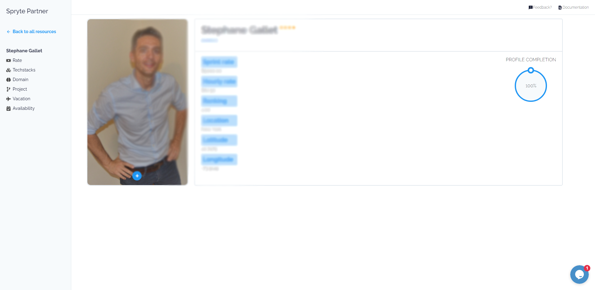

# The Spryte Partner Platform

The Partner Platform is meant for Technology vendors and agencies. If you currently hire and manage developers to create custom technology for your clients,
you can become a Spryte Partner by registering on the platform.

## Benefits

There are many benefits to joining the Spryte platform as a development partner. Think of us as your window into a whole new world of clients and projects.
Partners are instantly accessible by all spryte clients, who can search for development teams in real time. Pricing is transparent to the user, but your information is not revealed until after Clients have made a payment.  

## Use cases

1. Get More projects
2. See how you fit within the competitor landscape, and fine tune your business
3. Improve margins and remove operational friction

## Registration

1. To register, log on to [The Spryte Partner Platform](https://www.sprytelabs.com/partner). We will ask you for basic information about your business. Make sure the person registering your account has an appropriate role within your organisation to handle rates & contract decisions.

2. You can enter your developer's information one by one from the **Resources** page in the **Developer Roster** grid. Make sure you hit ***UPDATE*** after adding new rows or before leaving the page. 

3. A unique ACCESS CODE is generated for each developer. Because adding in all the required information such as stack, domain and project experience can take long time, you can provide each developer in your company with their **access code** and **unique id**. Using the **Developer Login** screen, they can gain access to their own unique profile, and add the information which matches their resume (CV) at their leisure. Individual developer pages have restricted access, they can add their own stacks, domains, project experience and personal information, but have no access to view or edit rates and any financial information.  

## Onboarding your developer data

As an account manager, you have multiple options for adding information about your Developer Roster. You can enter all their information one-by-one, but to get started quickly we recommend using the **bulk-import** function. 

### Bulk Import

On the **RESOURCES** page of your admin account panel, you will find an empty grid, with a blue **BULK UPLOAD** button. 

You can use the [Excel Spreadsheet provided](https://drive.google.com/file/d/1oU4f_E3H8pUriaM2rMU7xF5pIZwYqOrF/view?usp=sharing) to gather information from your team. Export it as a .csv, and copy the text into the bulk upload modal popup.

In case you have erroneous keys, the upload tool will inform you before saving. Ensure all rows are correct, and submit. Once you have successfully imported your developer roster, they will be displayed in the Resources Grid. 

We recommend you bulk-upload a roster of 50-100 developers to start with, in groups of 20-30.     

### Resume Upload

On the **RESOURCES** page of your admin account panel, you will find an empty grid, and to the top right of the grid a a blue **RESUME UPLOAD** button.
You can select up to 20 CVs in PDF format and they will be scraped for relevant information. **Be aware that it takes approximatly 20s per resume. If any errors occur you will be notified.**  The AI is still learning, so you can review the information for each scraped resume and choose "**IMPORT**" to keep what has been tagged, or "**EXCLUDE**" if the information is incorrect. (For example, random Stack names like *Section* or *Lateral* may be found in the body text of the CV which don't actually apply to this developer.) Fill out all the required info for each dev and click submit when you are done with ALL the CVs.

If you wish to distribute this work to individual developers on your staff, they also have the ability to upload their resume on their unique developer page. (see Registration / Point #3)

### Using the Resources Grid

You can select a developer from the grid, and their information will be displayed below. You can also double-click the developer to edit their information. You can also add individual developers, or remove them. 

> **Developers you enter into the Spryte Platform are automatically covered by our non-compete agreement, which means they cannot be hired/contracted without your approval by either Spryte or our Clients.**

#### Fields in the Resource grid: 
1. **Internal Id**: An internal code (your internal system code) you can use to track resources across Spryte and your own system.   
2. **First Name**
3. **Last Name**: If you do not wish to share developer full names, you may use a pseudonym or a single letter for their last name.
4. **Position**: Currently Spryte positions can be one of 
    - Architect
    - Jr. Developer
    - Mid. Developer
    - Sr. Developer
    - Designer
    - UI/UX
5. **Status**: An **Active** developer can be booked, an **Inactive** developer cannot be booked. We recommend you add your entire developer roster, and use the status toggle for developers you would like to book in the next few months.
6. **Rating**: A float rating (0.00 0 4.00) you can use to indicate your developer's standing within your team. This is YOUR evaluation of your developer's skill. Spryte rates your developers taking into consideration many inputs. Setting all your developers to the maximum has a negative influence on how we use it towards the overall rating. 
7. **Sprint Rate**: The 2-week 80h rate we use for subcontracting all developers. All Spryte contracts are 2-weeks and 80h.  
8. **Location**: The full text name of your developer's location. We recommend you use the city name. (i.e. New York, Bangalore, Kiev...)
9. **Latitude**: The actual lat & long of where your developer works, use [google maps to determine your actual geo-location.](https://support.google.com/maps/answer/18539?co=GENIE.Platform%3DAndroid&hl=en) We use this to match developers in real time for clients who need Local, Same-time-zone, or Global resources.   
10. **Longitude**
11. **Access Code**: This random auto-generated code can be changed for security. It allows your developers access to their own profile page. Use it to speed up onboarding and improve accuracy by making your developers add their own stack, domain & project experience. It should take them no more than 20 minutes for a very detailed profile.
12. **Developer ID**: This is your developer's unique ID within the Spryte platform. It is permanent. 

### Exporting your resources grid and Dev Sign-In

Instead of adding information for all your developers, you can send them their ID and Access Code. They can use the **Developer Sign-In** to edit their own profile. While the **Developer ID** is unique and persistent, you can change their access code at any time. Change their access code if you wish to prevent unauthorized editing. 

## Editing your Developer Profile

### Access
Each developer on a SPRYTE PARTNER roster can add/modify information on their profile at will. Your employer must provide you with your **Developer ID** as well as your **Access Code**. While your Developer ID is unique and persistent, your access code may be changed at will by your account manager. If you have difficulties logging-in, ask your account manager for the latest Access Code.

###  Editing your personal profile details

Each developer can edit their own information. The details are personal and change frequently as developers learn new technologies, improve their skills and accrue experience. The SPRYTE algorithm looks at all this information when picking teams.

The SPRYTE Matching algorithm currently takes into account:

#### Stacks

Your tech stacks are specific languages, libraries, tools, and systems. The list is curated by Spryte staff based on multiple criteria. There are thousands of referenced libraries, therefore is it important that you add as much detail as possible. This will make it easier for you to be booked.

NOTE: Spryte takes this information very seriously. We expect you to be truthful. If our audits determine the information you provided is innacurate and you have significantly overestimated your capabilities, you may lose the ability to be booked on the platform until the problem is rectified. 

#### Domain Knowledge

Clients are interested in your technical abilities, but your ability to speak their language, and understand their problems is key to project success. As such domain knowledge, which is prior experience working in a specific market, is extremely useful for our clients. For example, if you have previously worked on a payment integration project which lasted 6 months for a finance firm, mark your domain knowledge as Finance, 6 months, 1 project, Skill 1-4. 

#### Project Types

Clients often look for developers who have already proven themselves on a particular project type. Perhaps you have substantial experience using APIs (Google, Facebook, Stripe, Twitter...), and as such you will be faster in implementing this again for a new client. Mark down any experience you have for any of the project categories we are currently tracking.

#### Vacations

Please add your planned vacations for the next year. You can modify this at any time. Your account manager can see all your vacation information, while the clients you work for can see vacations you plan to take which affect their timeline.

#### Availability

Any projects booked through SPRYTE will be automatically displayed here. You may also add any other projects you are working on which may impact your availability towards bookings on the Spryte platform. For example, if you have an ongoing project and do not wish to be booked until it finishes, add a row describing your current project, and specifying the end date. The spryte platform will automatically try to book projects to keep you active.

### Profile Completion Score

In order for your developers to be considered on the platform, they must have a 100% Profile Completion Score. Each developer must have:
   1. 8 Stacks Minimum
   2. 4 Project Types
   3. 1 Domain 

   Developers who do not meet this criteria are probably too junior to be included. If your developers meet criteria we don't have on the platform currently, (stacks, domains or project types) please submit new types for review by using the "Request new Type" button. 