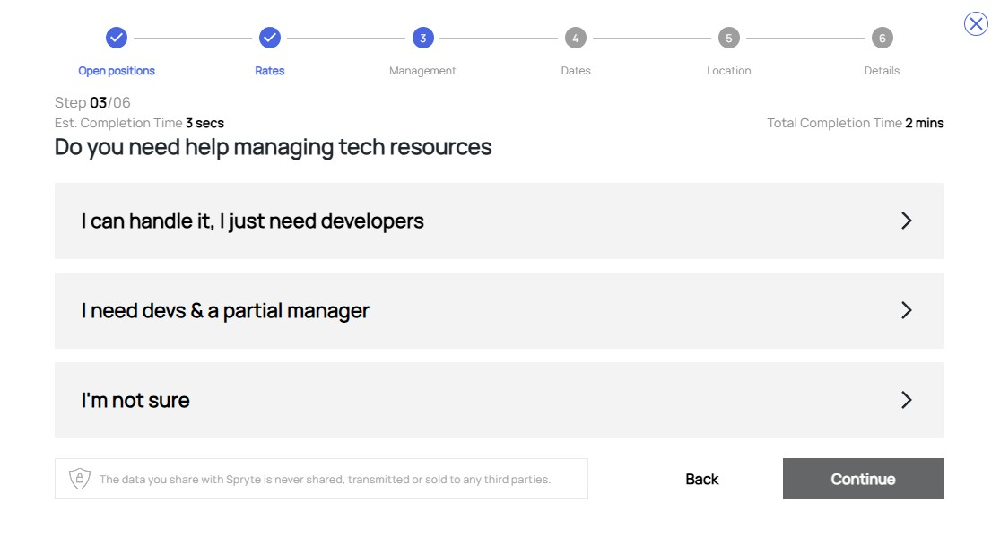

# Requirements

This guide outlines how to create and configure a new Requirement in Spryte. A Requirement represents a hiring need or project brief submitted by a company. Whether you're staffing individual positions or setting up a fully managed project, the requirement setup process collects all necessary details to help Spryte match your needs with highly qualified technology professionals.

## Requirements Dashboard

The My Requirements page lists all of your previously created or in-progress requirements. This view includes helpful summary information:

- List Name
- ID
- Teams
- Resources
- Status
- Created On

## Start a New Requirement
To start a new requirement, click the **Create New Requirement** button. This launches a multi-step guided form that walks you through every step needed to define your project.

---

### Step 1: Define Roles and Open Positions

Use plus/minus toggles to indicate how many hires you need for each role (e.g., Jr. Developer, QA Engineer, Product Manager). This flexibility allows for building complete teams with different types of expertise.

---

### Step 2: Set Budgets

Assign a budget for each role by adjusting a slider or choosing from preset rate ranges. This ensures Spryte can surface candidates who fit your compensation expectations.

---

## Step 3: Define Management Needs

Select your level of support for managing the project:
- I can handle it, I just need developers – You manage your team directly (Staffing).
- I need devs & a project manager – You’ll receive project management support (Managed Project).
- I'm not sure – Our team will help determine the right engagement type for your goals.

---

### Step 4: Set Project Timing

Define how soon your project needs to start:
- Urgent Need – Start as soon as possible.
- Ongoing Need – No set deadline, rolling engagement.
- Set a Specific Date – Choose a target start date for planning purposes.

---

### Step 5: Set Team Location

Select where your team will be based:
- Remote – Candidates can work from anywhere.
- Hybrid – A mix of in-office and remote work.
- On-site – Candidates must work in your designated location.

This setting influences candidate matching based on availability and commute preferences.

---

### Step 6: Name and Describe Your Requirement

Choose a title and write a short description of your project’s goals, team structure, and business context. This helps candidates and Spryte staff quickly understand your objectives.

---
 

# Requirement Page

Each submitted requirement appears as its own page. It consolidates all your selections, candidate matches, and hiring actions.

## Overview Panel

At the top, you’ll see high-level details:
- Engagement Type: Either Staffing or Managed Project
- Start Window & Duration: When the project begins and how long it’s expected to last
- Spryte Terms: Confirms whether platform terms have been accepted

## Review and Pick Resources

### Team & Project Information
- *Existing Team & Environment*: Describe the overall project, who the clients are, what you're building that is new or different, and with which technologies. Developers want to understand what they'll be working on and toward what goals.
- *Project Stack*: Provide an overview of the position you're hiring for, including the specific skills and expertise required. Outline the key responsibilities, the technologies the developer will work with, and any challenges they might face
- *Team Location*

### Roles

Each role displays as a separate tab. From here, you can:
- Filter, comment, or update job parameters
- Track which candidates are proposed for each position
- View rankings and rates

Each role tab includes detailed filters to help with evaluation:
- Max rate: Your upper budget limit for the role.
- Contract Type (W2, Corp2Corp, etc.)
- Commute Type (Remote, Hybrid, On-site)
- Dedication (Full-time, Part-time, Hourly)
- Required Skills: Essential qualifications that every candidate must meet.
- Good to Have: Bonus qualifications that enhance the fit but are not mandatory.
- Required Assessments: Attach assessments that candidates must complete to qualify

### Candidate Table & Actions
Each proposed candidate appears in a sortable table with the following columns:
- Rating: Ranking based on fit
- Experience: Years of relevant experience
- Rates: Proposed rate and rate type
- Last Updated: When the profile was last reviewed
- Rank: Spryte ranking

Use view toggles to switch between table and tile views.

#### Candidate Actions
- Pick: Select a candidate to move forward with
- Interview: Request an interview via Spryte
- Remove: Discard a candidate from the shortlist
- View Profile: See full resume, skill ratings, and portfolio
- Add Note: Share internal comments visible to your team
- Add Tag: Create and assign categories for candidate tracking (e.g., "Design Lead", "Quick Start")

#### Notification Preferences
Control how often you’re notified about new matches:
- Real-time
- Daily
- Weekly
- Monthly
- Quarterly
- Yearly
